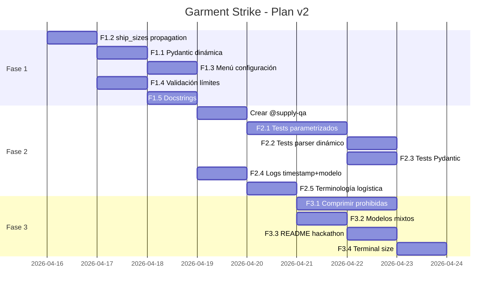

# 🗺️ Plan de Cambios v2 — Garment Strike: Configuración Dinámica & Calidad

**Fecha**: 15 Abril 2026  
**Objetivo**: Hacer el juego completamente configurable desde el menú interactivo, estabilizar los tests y cerrar deuda técnica del backlog.

---

## 📊 Auditoría del Estado Actual

### Bugs & Inconsistencias Detectadas

| # | Severidad | Problema | Archivo |
|---|-----------|----------|---------|
| 1 | 🔴 **Crítico** | `AgentMove` en `llm_client.py` valida coordenadas con regex fija `[A-J](10\|[1-9])`. En tableros 6×6, disperos a `J10` pasan Pydantic y explotan en el motor. | `core/llm_client.py:37` |
| 2 | 🟡 **Medio** | `_make_ships()` en tests crea barcos con columnas `G`, `I` (10×10). Si `REQUIRED_SHIP_SIZES` cambia a `[3,3,2]`, los tests de Board/Game siguen usando 5 barcos hardcodeados y explotan por validación de tamaños. | `tests/test_engine.py:167-179` |
| 3 | 🟡 **Medio** | `Board.__init__` acepta `ship_sizes` pero `_validate_placement()` compara contra `REQUIRED_SHIP_SIZES` (constante global), ignorando el parámetro recibido. | `core/engine.py:160-165` |
| 4 | 🟡 **Medio** | `generate_random_layout()` ignora `ship_sizes` param; siempre usa `REQUIRED_SHIP_SIZES`. | `core/engine.py:353-362` |
| 5 | 🟢 **Bajo** | Menú interactivo (opción 3) no permite configurar `board_size`, `ship_sizes` ni `max_turns`. Usa hardcoded `almacen_ejemplo`. | `main.py:146-179` |
| 6 | 🟢 **Bajo** | Docstring de `engine.py` dice `"sizes 5,4,3,3,2"` — ya no es fija. | `core/engine.py:7` |
| 7 | 🟢 **Bajo** | Comentario duplicado `"# Ask the LLM for a move"` en tournament.py. | `core/tournament.py:233-234` |
| 8 | 🟢 **Info** | `settings.yaml` tiene `ship_sizes: [3,3,2]` pero el default del CLI sigue siendo `[5,4,3,3,2]` si el YAML no se carga. Desincronización silenciosa. | `main.py:242` |

### Items del Backlog que este plan aborda

| Item Backlog | Fase |
|---|---|
| ✅ Crear un menú básico (Tests, Partida normal, Partida minimalista, Selección modelo) | F1 |
| ✅ Tamaño de tablero dinámico (completar propagación) | F1 |
| ✅ Organizar todas las pruebas unitarias | F2 |
| ✅ Tiro forzado random excluyendo coordenadas atacadas | F1 (validar) |
| ✅ Traducir términos Battleship → Logística | F2 |
| ✅ Que en logs aparezca fecha/hora y modelo | F2 |
| ⬜ Comprimir información de celdas prohibidas | F3 |
| ⬜ Explorar distintos modelos por jugador | F3 |
| ⬜ Asegurar portabilidad (README + install guide) | F3 |

---

## 🧩 Fases de Implementación

### FASE 1 — Motor Elástico + Menú Configuración _(Prioridad NOW)_

**Objetivo**: Que `board_size`, `ship_sizes` y `max_turns` se propaguen correctamente por todo el stack y sean configurables desde el menú interactivo.

**Rama**: `feature/elastic-config-menu`

#### Tareas

| ID | Tarea | Agente | Archivos |
|----|-------|--------|----------|
| F1.1 | **Validación Pydantic dinámica**: `AgentMove` debe recibir `board_size` como contexto de validación. Opción: usar `model_validator` con campo `board_size` oculto, o validar *después* de parseo en `tournament.py`. | `@supply-dev` | `llm_client.py`, `tournament.py` |
| F1.2 | **Propagación de `ship_sizes`**: `Board._validate_placement()` y `generate_random_layout()` deben usar `self.ship_sizes` en vez de `REQUIRED_SHIP_SIZES`. Completar lo que se revirtió manualmente. | `@supply-dev` | `engine.py` |
| F1.3 | **Pantalla de Configuración de Partida**: Refactorizar opción 3 del menú para preguntar interactivamente: `board_size`, `ship_sizes`, `max_turns`, selección de modelo, y selección de equipos desde el directorio `agentes/`. | `@supply-dev` | `main.py` |
| F1.4 | **Validación de límites**: Max ship size ≤ board_size. Min ship size ≥ 2. Total cells ≤ 50% board area. Lanzar error claro si no se cumple. | `@supply-dev` | `engine.py` |
| F1.5 | **Actualizar docstrings**: `engine.py:7` ("sizes 5,4,3,3,2") y comentario duplicado en `tournament.py:233`. | `@supply-dev` | `engine.py`, `tournament.py` |

#### Criterios de Aceptación (F1)
- [ ] `python main.py` → opción 3 → permite configurar tablero, cajas y turnos antes de jugar.
- [ ] `--ship-sizes 3,2,2 --board-size 6` ejecuta una partida completa sin errores.
- [ ] El LLM no puede disparar fuera del rango del tablero (validación pre-motor).
- [ ] `generate_random_layout(size=6, ship_sizes=[3,2,2])` genera un layout válido.

---

### FASE 2 — Tests Elásticos + Logs Mejorados _(Prioridad NEXT)_

**Objetivo**: Que los tests soporten cualquier configuración y que los logs incluyan metadatos útiles.

**Rama**: `feature/elastic-tests-logging`

#### Tareas

| ID | Tarea | Agente | Archivos |
|----|-------|--------|----------|
| F2.1 | **Parametrizar tests del motor**: `_make_ships()` y `_make_valid_board()` deben aceptar `ship_sizes` y `board_size`. Añadir fixtures parametrizadas con `@pytest.mark.parametrize` para probar `[5,4,3,3,2]`, `[3,3,2]` y `[2,2]`. | `@supply-qa` | `test_engine.py` |
| F2.2 | **Tests del AlmacenParser dinámico**: Verificar que `parse_with_status()` con `ship_sizes=[3,2,2]` genera layouts correctos y rechaza configuraciones inválidas. | `@supply-qa` | `test_engine.py` |
| F2.3 | **Tests de validación Pydantic dinámica**: Verificar que `AgentMove` rechaza `J10` cuando `board_size=6`. | `@supply-qa` | `test_llm_client.py` |
| F2.4 | **Logs con timestamp y modelo**: Añadir `datetime.now()` y `model_name` a cada línea de `match_turns.log`. Formato: `[2026-04-15 18:30:12] [groq/llama-3.1-8b] [T  5] Alpha -> E5 \| ...` | `@supply-dev` | `tournament.py` |
| F2.5 | **Terminología logística en salida LLM**: Asegurar que las respuestas del LLM que se muestran en la UI usen "Prenda/Pedido" en vez de "HIT/SUNK". | `@supply-dev` | `tournament.py`, `visualizer.py` |

#### Criterios de Aceptación (F2)
- [ ] `python -m pytest tests/ -v` → 100% pass con `ship_sizes=[3,3,2]` en `settings.yaml`.
- [ ] `python -m pytest tests/ -v` → 100% pass con `ship_sizes=[5,4,3,3,2]` en `settings.yaml`.
- [ ] `match_turns.log` muestra fecha/hora y nombre del modelo en cada línea.
- [ ] El test `test_col_G_rejected_on_6x6_board` pasa.

---

### FASE 3 — Optimización & Portabilidad _(Prioridad LATER)_

**Objetivo**: Reducir el consumo de tokens en celdas prohibidas, soportar modelos mixtos y preparar el README para el hackathon.

**Rama**: `feature/optimization-portability`

#### Tareas

| ID | Tarea | Agente | Archivos |
|----|-------|--------|----------|
| F3.1 | **Comprimir celdas prohibidas**: Agrupar por resultado: `MISS: A1,B2,C3 \| HIT: D4,E5 \| SUNK: F6,G7`. Reducción estimada: ~40% tokens. | `@supply-optimizer` | `llm_client.py`, `prompts.py` |
| F3.2 | **Modelos mixtos por jugador**: Permitir `--model-a` y `--model-b` en CLI y menú. | `@supply-dev` | `main.py`, `tournament.py` |
| F3.3 | **README para el hackathon**: Instrucciones de instalación, obtención de API keys (Groq, Gemini, OpenAI), estructura de carpetas de equipo y ejemplo de ejecución. | `@supply-dev` | `README.md` |
| F3.4 | **Fijar tamaño de terminal**: Detectar dimensiones e intentar ajustar automáticamente, o fallar con mensaje claro. | `@supply-dev` | `visualizer.py` |

---

## 👥 Análisis de Agentes

### Agentes Actuales

| Agente | Rol | ¿Cubre estas fases? |
|--------|-----|---------------------|
| `@supply-dev` (SupplyDev) | Implementación, bugs, refactoring | ✅ F1, F2 (parcial), F3 |
| `@supply-optimizer` (SupplyOptimizer) | Performance, tokens, caching | ✅ F3.1 |
| `constructor-proyecto` (SupplyPM) | Planificación, priorización | ✅ Coordinación |

### ⚠️ Gap Detectado: Falta un agente de QA

Las tareas F2.1, F2.2 y F2.3 son **exclusivamente de testing**. El agente `@supply-dev` puede hacerlas, pero su definición dice _"implementar features, corregir bugs"_ — no está especializado en diseño de tests.

> [!IMPORTANT]
> **Recomendación**: Crear un nuevo agente **`@supply-qa`** especializado en:
> - Diseño de fixtures parametrizadas
> - Cobertura edge-case (tableros mínimos 6×6, máximos 10×10)
> - Tests de regresión contra configuraciones dinámicas
> - Validación de que los tests **no dependen** de constantes globales

### Agente Propuesto: `@supply-qa`

```yaml
name: SupplyQA
description: "QA: diseñar, implementar y mantener tests unitarios y de integración para BT-Supply-Impulse."
tools: [read, search, edit, execute]
scope: tests/, core/ (solo lectura)
skills:
  - Diseño de fixtures parametrizadas (pytest)
  - Tests de regresión para configuraciones dinámicas
  - Validación de cobertura edge-case
  - Verificación de independencia de tests respecto a constantes globales
```

---

## 📅 Cronograma Propuesto



---

## 🎯 Resumen Ejecutivo

| Métrica | Valor |
|---------|-------|
| **Fases** | 3 |
| **Tareas totales** | 14 |
| **Agentes necesarios** | 4 (dev, optimizer, PM, **QA nuevo**) |
| **Archivos impactados** | 9 |
| **Items backlog resueltos** | 9 de 15 |
| **Riesgo principal** | Tests existentes dependen de `REQUIRED_SHIP_SIZES` global — romperán si se cambia la constante sin actualizar fixtures |
